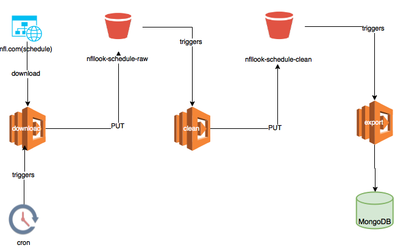

# nfllook-tools-schedule
Download, clean and export to MongoDB NFL schedule

## Prerequisites:
1. AWS account
2. node.js
3. Serverless Framework
4. https://serverless.com/framework/docs/providers/aws/guide/credentials/
5. MongoDB
6. Create config.yml(.gitignore and .npmignore!) file based on config.template.yml

## Deploy AWS lambda functions
npm install

sls deploy

## Invoke download function(it will trigger other lambda functions)
sls invoke local --function download
